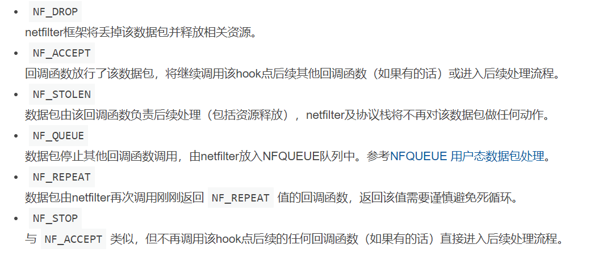

# I2PMM 

Intermediate IP Modification Module

## design

use netfilter to send message

```c
unsigned int nf_out_hook_proc( void * priv, struct sk_buff * skb, 
		        const struct nf_hook_state * state );

static struct nf_hook_ops nf_local_out = {
	.hook = nf_out_hook_proc,
	.priv = NULL,
	.pf = PF_INET,
	.hooknum = NF_INET_POST_ROUTING,
	.priority = NF_IP_PRI_FIRST ,
};

nf_register_net_hook( &init_net, &nf_local_out );
nf_unregister_net_hook(&init_net,  &nf_local_out );
```

use packet_type to recv message

```c
static int dev_in_proc( struct sk_buff * skb, struct net_device * dev,
		        struct packet_type * ptype,struct net_device *oridev);
static struct packet_type dev_in = {
	.type = htons(0xf4f0),
	.func = dev_in_proc
};

dev_add_pack( &dev_in );
dev_remove_pack( &dev_in );
```

## Operator  

1. build
```shell
make
make clean
```

2. install/uninstall module
```shell
sudo insmod i2pmm.ko
sudo rmmod  i2pmm.ko
lsmod | grep i2pmm
```

3. show info
```shell
# show
dmesg
tail -f /var/log/kern.log
# clear
sudo dmesg -c  
```

## note

```c
// include/uapi/linux/netfilter.h
/* Responses from hook functions. */
#define NF_DROP 0
#define NF_ACCEPT 1
#define NF_STOLEN 2
#define NF_QUEUE 3
#define NF_REPEAT 4
#define NF_STOP 5
#define NF_MAX_VERDICT NF_STOP
```



**Usually, use NF_STOLEN**

## Reference

[ CSDN: Zzxy1999_ ] : https://blog.csdn.net/qq_40955029/article/details/124504711

[         network         ] : https://www.kancloud.cn/pshizhsysu/network/2147682

